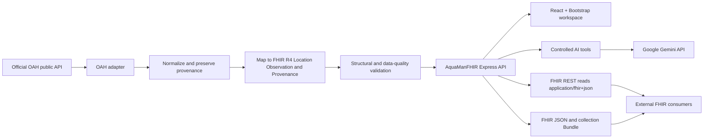

# Data Flow

```mermaid
flowchart LR
  OAH[Official OAH public API] --> A[OAH adapter]
  A --> N[Normalize and preserve provenance]
  N --> M[Map to FHIR R4 Location Observation and Provenance]
  M --> V[Structural and data-quality validation]
  V --> API[AquaManFHIR Express API]
  API --> UI[React + Bootstrap workspace]
  API --> TOOLS[Controlled AI tools]
  TOOLS --> GEMINI[Google Gemini API]
  API --> FHIR[FHIR REST reads application/fhir+json]
  API --> EXPORT[FHIR JSON and collection Bundle]
  FHIR --> EXT[External FHIR consumers]
  EXPORT --> EXT
```

Live inputs are the four endpoints documented in `oah-data-discovery.md`. Citizen-science, water-colour/flow, and OAH-specific FHIR data are not part of the current verified flow.
